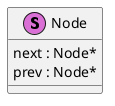
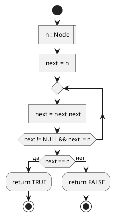

# Example

## About

This is an example of literate style programmig.
It has several sections, a few dedicated to modeling and one to
implementation of model in C language.

## Основные абстракции

Узел (Node). Это структура дважды-связанного списка с одним элементом списка.



Описание Alloy:

```alloy
sig Node {
  prev: Node,
  next: Node
}
```

**prev** и **next** - это отношения связывающие текущий элемент с предыдущим
и последующим.

И соответствующая С-структура:
```c
struct node {
  struct node *prev;
  struct node *next;
};
```

### Логические ограничения на списки

#### Корректность

Все списки из элементов правильно связаны. То есть текущий элемент является предыдущим
для следующего и наоборот. В противном случае у нас получатся деревья или графы с циклами.

```alloy
fact valid {
  all N : Node | -- для всех узлов выполняется:
    N.prev.next = N -- следующий у предыдущего указывает на текущий
    and N.next.prev = N -- предыдущий у следующего указывает на текущий
}
```

И функция на C для проверки:
```c
int valid(struct node* n)
{
  return n->next && n->next->prev == n &&
         n->prev && n->prev->next == n;
}
```

## Функции для работы со списками

### Проверка цикличности



Сначала модель на **Alloy**:

```alloy
pred is_cyclic[n:Node] {
  n in n.^Node.next -- ^Node.next - транзитивное замыкание
                    -- получаем отношение всех достижимых узлов
                    -- n.^Node.next - все узлы достижимые из n
}
```
Теперь код:

```c
int is_cyclic(struct node* n)
{
  struct node* next = n;
  do {
    next = next->next;
  } while (next && next != n);
  return next == n;
}
```
